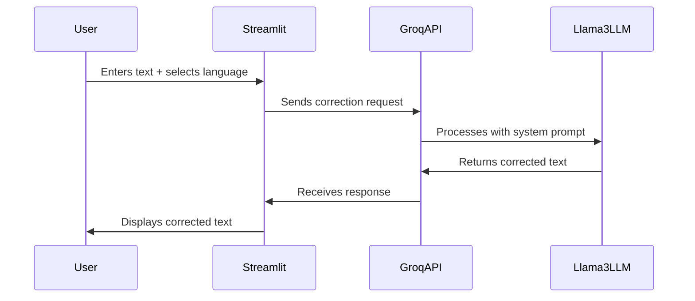

# 📝 AI-Powered Grammar & Spell Checker


### 📖 Check out my blog: [Click Here ](https://medium.com/@msusimran20/ai-powered-grammar-spell-checker-c9fb4d33975f)

## 🚀 Try It Out  
🔗 **Live Demo:** [Click Here](https://ai-powered-grammar-spell-checker-hyndfylzmob5tn4wffyjap.streamlit.app/)


## 🚀 Overview
This project is an AI-powered grammar and spell checker that utilizes **Groq's LLM (Large Language Model)** to correct spelling, grammar, and context errors in both **English and Hindi**. The application is built using **Streamlit** for an interactive user experience.

---
## ✨ Features
- ✅ Supports **English** and **Hindi**
- 🔍 AI-driven **Grammar & Spell Correction**
- 🎨 **User-friendly UI** with a dark theme
- ⚡ **Instant Results** with a single click
- 🏠 Built with **Streamlit** for easy deployment

---
## 🌟 Why **Llama3-8B-8192**?
This project uses **Groq's Llama3-8B-8192** model, Meta's advanced large language model optimized for fast inference. It was chosen because:
- ✅ **High Accuracy:** It effectively detects and corrects grammatical errors while preserving context and meaning.
- ⚡ **Lightning Fast:** Groq's hardware acceleration provides ultra-fast response times, making it ideal for real-time applications.
- 💡 **Superior Context Understanding:** Llama3-8B excels at maintaining sentence coherence, nuance, and natural language flow.
- 📚 **Efficient Processing:** Can handle complex and lengthy text inputs with remarkable efficiency and accuracy.
- 🎯 **Multilingual Support:** Excellent performance in both English and Hindi language correction tasks.

---
## 🌍 How This Project Works
1. The user enters text that needs correction.
2. The app sends the text to **Groq's LLM API**, which processes the input using the advanced Llama3-8B-8192 model.
3. The LLM analyzes the text for grammar, spelling, and contextual errors.
4. The corrected text is then returned and displayed to the user.

### 🧠 How LLM Works in This Project
- **Text Input:** User provides raw text in English or Hindi.
- **System Prompt:** The LLM is instructed to act as a grammar and spell checker.
- **Processing:** The model detects errors and improves sentence structure while keeping the original meaning intact.
- **Output:** A refined and corrected version of the input is returned.

---
## 📝 System Prompt Used
The model is instructed with a carefully designed **system prompt** to ensure accurate and context-aware corrections. The prompts used are:

### **English Prompt**
```plaintext
You are an advanced English grammar and spell checker. Correct the text while maintaining its meaning.
```

### **Hindi Prompt**
```plaintext
आप एक अत्याधुनिक हिंदी व्याकरण और वर्तनी सुधारक हैं। 
कृपया दिए गए हिंदी पाठ को सही करें लेकिन उसका अनुवाद न करें। 
केवल व्याकरण, वाक्य संरचना और वर्तनी की त्रुटियों को ठीक करें, अर्थ को वैसा ही रखें।
```

### 🔄 Why These Prompts Are Used
- ✅ **Ensures Precision:** The prompts explicitly ask the LLM to focus on correcting grammar and spelling while maintaining context.
- 🌐 **Supports Multiple Languages:** Language-specific prompts allow optimal performance for English and Hindi.
- 💠 **Preserves Meaning:** The instruction ensures that the original intent of the text remains intact.
- 🎯 **Optimized for LLM Processing:** It minimizes ambiguity, making the model's responses more predictable and reliable.
- 🚫 **Prevents Translation:** Specifically instructs Hindi corrections without translation to English.

---
## 🛠️ Installation
### 🔹 Prerequisites
Make sure you have **Python 3.8+** installed on your system.

### 🔹 Setup
```bash
# Clone this repository
git clone https://github.com/SimranShaikh20/grammar-checker.git
cd grammar-checker

# Install dependencies
pip install -r requirements.txt

# Run the application
streamlit run app.py
```

---
## 🌌 API Integration
This project uses **Groq LLM API** for text correction. 

### 🔹 API Endpoint
```plaintext
POST https://api.groq.com/openai/v1/chat/completions
```

### 🔹 Example API Request
```python
import requests

API_KEY = "your_groq_api_key"
text_to_correct = "Thiss is an exemple of baad grammr."
language = "English"

url = "https://api.groq.com/openai/v1/chat/completions"
headers = {"Authorization": f"Bearer {API_KEY}", "Content-Type": "application/json"}

payload = {
    "model": "llama3-8b-8192",
    "messages": [
        {"role": "system", "content": "You are an advanced English grammar and spell checker. Correct the text while maintaining its meaning."},
        {"role": "user", "content": f"Correct this English text: {text_to_correct}"}
    ],
    "temperature": 0.2,
    "max_tokens": 500
}

response = requests.post(url, headers=headers, json=payload)
print(response.json()["choices"][0]["message"]["content"])
```

---
## 🎨 UI Customization
This project includes **custom CSS styling** for a modern UI:
- 🌑 **Dark mode** background
- 🌟 **Multicolored gradient buttons**
- 🌍 **Styled text inputs** with improved readability
- 🛠️ **Custom sidebar** with a sleek layout

---
## 🔮 Future Enhancements
- 🚃 **Voice Input Support**
- 📚 **Multi-language Support** (Spanish, French, etc.)
- 🖊 **Auto-correction while typing**
- 🌐 **Deploy as a Web App**

---


## 🔄 Workflow



## 🐟 License
This project is licensed under the **MIT License**.

---
## 🎯 Author
**Simran Shaikh**

🚀 Made with ❤️ by **Simran**